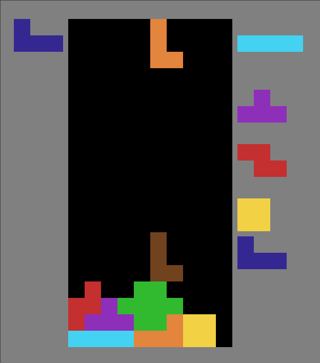

# dedtris
A extendable tetris game written in Rust. Extensions are written in Lua.

     
    Game in progress

## Installation
The prebuilt binaries can be found [here](https://github.com/Majtris/majtris/releases).

## Build
The build process involves installing the [rust toolchain](https://www.rust-lang.org/tools/install) and installing the required [SDL2 libraries](https://www.libsdl.org/download-2.0.php) which the build depends on.

1. `git clone https://github.com/Majtris/majtris.git`
### Windows
2. Download [SDL2](https://www.libsdl.org/download-2.0.php) and [SDL2_image](https://www.libsdl.org/projects/SDL_image/) development libraries.
3. Extract all .dll and .lib files usually located under `.\lib\x64\` into the root of the project.
4. `cargo run`
### Linux
2. Using your package manager install the development libraries for SDL2 and SDL2 image. Example Debian: `sudo apt install libsdl2-dev libsdl2-image-dev`.
3. `cargo run`
### MacOS
2. For building the project it's recommended to have [homebrew](https://brew.sh/) installed. So then installing the dependancies is simply as follows: `brew install sdl2 sdl2_image`.
3. `cargo run`
